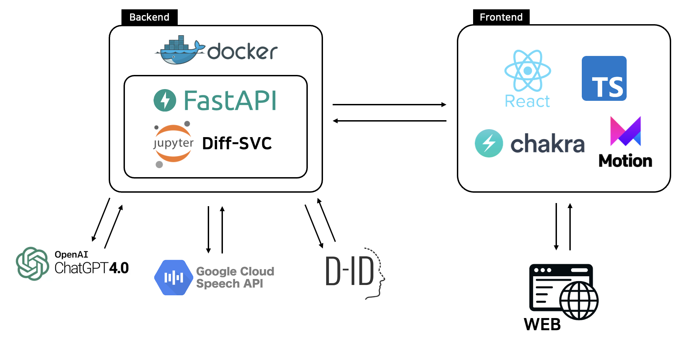

# ProfAIssor 🤖

**ProfAIssor** is an online tutoring platform that embodies professors as virtual entities, enabling students to effortlessly pose class-related queries and receive timely responses, unbound by limitations of time and location. When a student selects a professor and submits a question, ChatGPT generates an initial response. The professor has the ability to refine and update these answers, aligning them more closely with their expertise and viewpoints. Responses are presented as lifelike video representations, aiming to mirror the professor's appearance and voice as authentically as possible using [DiffSVC](https://github.com/UtaUtaUtau/diff-svc), [Google Cloud TTS](https://cloud.google.com/text-to-speech), and [D-ID](https://www.d-id.com/). This immersive approach cultivates a sense of direct mentorship, empowering students to bridge the educational divide by fostering a stronger connection with their educators.
  

## Architecture

## Awards

Second Prize at 2023 SKKU AI-Education Capstone Design Competition
  

## Developers
### Team Acappella
- [Dayoon Kang](https://github.com/daayuun)
- [Seojin Kim](https://github.com/SeojinSeojin)
- [Yoonjae Baek](https://github.com/whyjyj)
- [Dongseop Lee](https://github.com/ddongseop)
- [Serin Yoon](https://github.com/serin-yoon)
  

## For more information...
Please refer to [this page](./assets/poster.pdf).
